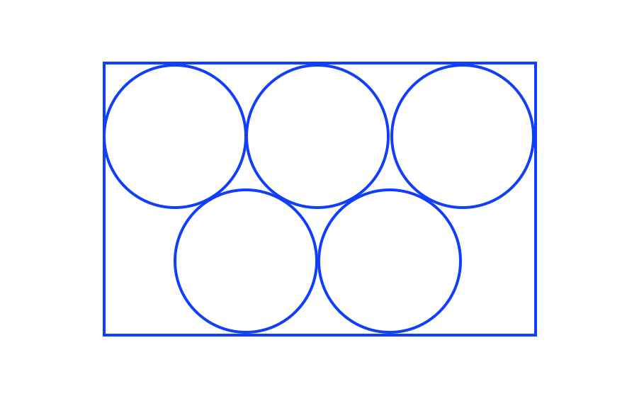

VQVQV  158 + 170 

第一第二个v都还好，第三个v极难
第二个Q极难

第二个V（我猜这个是加试）

- 填空 31-6 46-6 （这是同一题）
- 填空 74-3
- 填空 98-7

第三个V

- 阅读 passage 139

第一个Q

1. 三角形三个内角分别是 x度, y度, 60度。 y<50
比较大小:
	- A: x
	- B: 70
	
1. 有一个人有两个不同的农场分别是 0.5 arces， 1.5 arces。 请问两个农场加起来是多少 **square feet** ？  (1 arcen is 4840 square yard.  1 yard is 3 feet)

14. 一个半圆，弧长为20，问这个半圆的面积? (选择题，保留 $\pi$)

2. 一个村子有50%的人支持新政策，30%的人反对新政策。以下哪句话**单独**可以得出整个村子的人数。多选
 - A 不支持也不反对的人有100个
 - B 支持的人是不支持也不反对的人的2.5倍
 - C 支持的人比不支持也不反对的人多100人

14. u,v,w,x,y 五个数满足下面的性质 （都是相乘）
	- uvwxy 是偶数
	- uvwx 是偶数
	- uvw 是偶数
	- uv 是奇数

	问五个数中哪一个**不可能**是奇数？
	
第二个Q

1. S={1,2,3,4,5,6,7,8,9} 从S集合中有替代得随机取 (select with replacement) 三次, 把三个数字按顺序摆放组成一个三位数。这个三位数大于 600的概率为 p。比较大小:
	- A: p
	- B: 4/9
 
2. A = {1,2,3,4,5}, B = {6,7,8,9}
 从集合A取一个数，从集合B取一个数，他们的和有多少种可能？
 
2. x<=y, y<=z 比较大小:
	- A: z-x
	- B: y-x

11. a > 1 比较大小
	- A: a/(a-1) 
	- B: (a+1)/a

12. 家庭装麦片相对于普通装卖票重了10盎司，贵了50美分。 比较大小：
	- A: 家庭装麦片每盎司的价格
	- B: 5美分

13. 三个数 0, x, $x^2$， 它们的中位数比他们的平均数大， 比较大小：
	- A: x
	- B: 2

3. x<0 比较大小:
	- A: $(2^x)^2$
	- B: $(x^2)^x$
	
3. 一个直角三角形的两个直角边等长，面积36. 一个正方形的面积36. 比较大小:
	- A: 直角三角形的周长
	- B: 正方形的周长

3. BE = 1/2 EC , 矩形ABCD面积为24，求三角形 DEC 的面积 
 

3. A盒子有三个红球，五个蓝球，两个黄球。 B盒子有四个红球，六个蓝球。 A，B盒子里面分别取一个球，问两个球里面至少有一个黄球的概率？

4. x>0, n是一个正整数。 8x/n 小于x的百分之0.5，问n的最小可能值。 

5. 图表题第三题， 
	五个动物园的参观人数分别是 （单位 million）
	- 3.0
	- 1.3 
	- 2.7 
	- 1.7 
	- 0.7
	
 如果三个动物园的参观人数加起来能够超过 4 million，就可以满足申请一个国家基金的资格。问这五个动物园中，满足资格的三个动物园组合有几种？ （填空题，不是选择题）

10. 三角形ACO为直角三角形，AC =2 ， 角ACO = 30度，求圆锥 ABC的体积。精确到整数。 （体积公式题目中说了）

11. 比较大小：
	- A: 5和16的最大公约数
	- B: 25和256的最大公约数

12. A为所有小于100的正奇数组成的集合。 B = {2,4}。 从A 和 B中分别取一个数，两个数相乘，问乘积有几种情况？

来自其他人的1105

1. (来自SrPeppermints)
	五个圆的直径都是4，如图中互相相切，并且和矩形相切，问长方形的面积
	- A. $24 + 24\sqrt{2}$
	- B. $24 + 24\sqrt{3}$
	- C. $48 + 24\sqrt{2}$
	- D. $48 + 24\sqrt{3}$
	- E. $96$
	